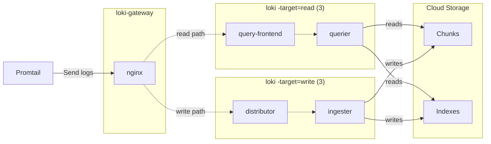

# loki-docker-compose
Standalone docker setup to create a loki datasource for Grafana

### Running locally
- setup loki configuration in `config/loki.yaml`. Important ones are 
- setup number of read/write targets in `compose.yaml`
- setup listen ports for loki-gateway in `compose.yaml`
- start the containers e.g. `podman-compose up -d`

## Architecture

Ref : https://github.com/grafana/loki/blob/main/production/docker/README.md