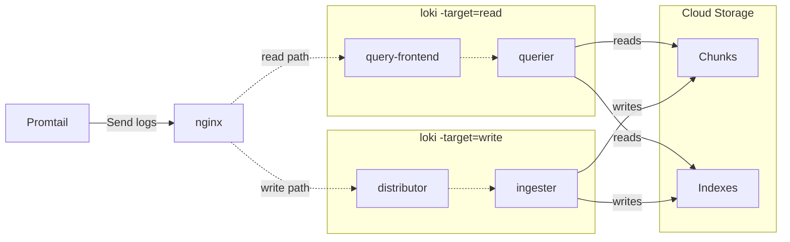

```mermaid
graph LR
    Promtail -->|Send logs| nginx

    nginx -.-> |read path| QueryFrontend
    nginx -.-> |write path| Distributor

    subgraph LokiRead["loki -target=read"]
        QueryFrontend["query-frontend"]
        Querier["querier"]

        QueryFrontend -.-> Querier
    end

    subgraph Minio["Cloud Storage"]
        Chunks
        Indexes
    end

    subgraph LokiWrite["loki -target=write"]
        Distributor["distributor"] -.-> Ingester["ingester"]
        Ingester
    end

    Querier --> |reads| Chunks & Indexes
    Ingester --> |writes| Chunks & Indexes
```